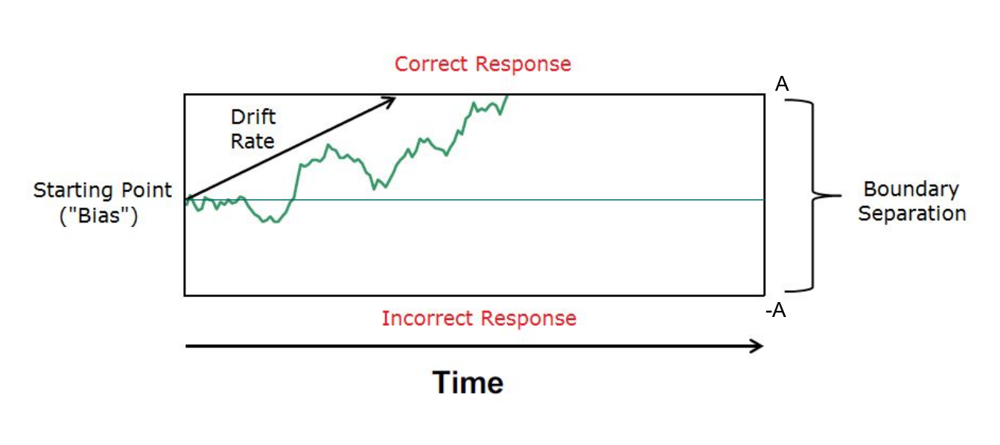
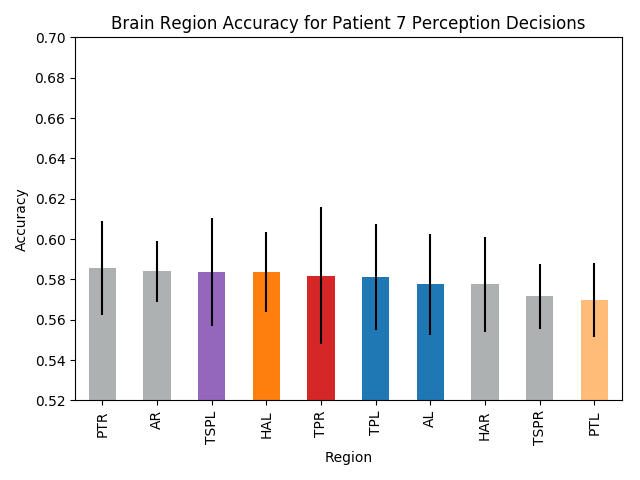
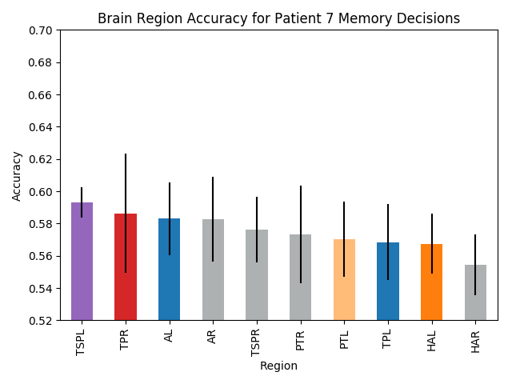
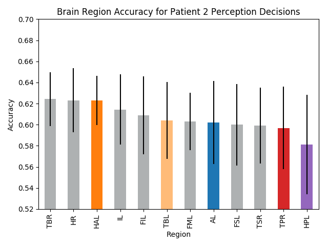
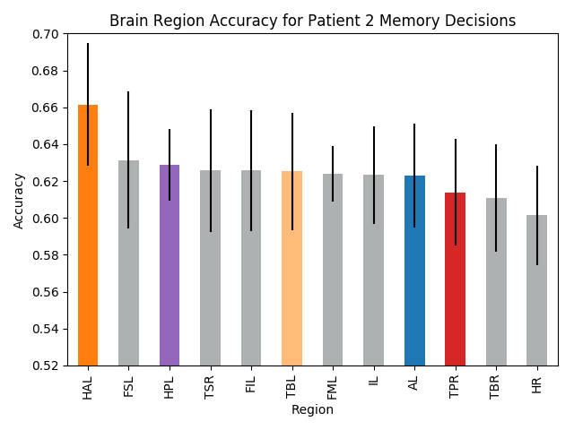
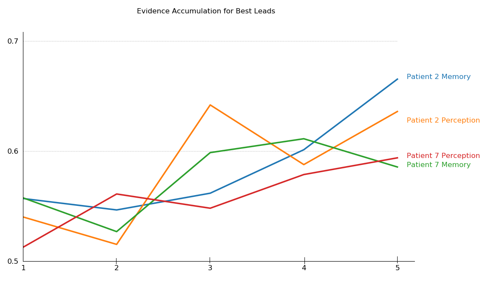

# Analysing the Human Decision Making Process through iEEG data

Please note that this does not represent the full paper, but merely an introduction to the problem tackled.

## Abstract
The following project focuses on the two tasks of firstly localizing the brain regions in which memory and perception decisions are made, and secondly, providing evidence of the drift diffusion process in neural activity during an individuals decision making process.The data involved in this project was collected through experiments involving patients having brain activity read via an Intracranial Electroencephalograph (iEEG). Both traditional signal processing and machine learning tools were utilized in order to achieve the outlined goals. The relevant brain regions were localized through modeling of individual leads, whilst evidence of the drift diffusion process was collected by analyzing multiple machine learning model behaviours over the course of a decision.

## Introduction
Decision making is an integral part of the human brain’s every-day function.  These decisions range from complex dissertations, all the way to basic yes-no resolutions. Research suggests that the decision making process can be modelled as a continuous collection of information (evidence)over time. Such a process, that leads to a binary decision, can be described with the use of the Drift Diffusion Model (DDM) (Ratcliff, 1978). The idea behind this being that, if neuronal activity were to be captured, it would depict the accumulation of evidence over time until it reaches a(decision) threshold (Ratcliff, Smith, Brown, & McKoon, 2016). A DDM can be depicted as in Figure 1, wherein the Drift Diffusion Process approaches a threshold towards one of the binary targets, in this case A and −A.

With the advent of modern medical technology such as the Intracranial Electoenceohalograph (iEEG), such neural activity can be studied through the recording of electrical activity in the brain without major noise such as muscle and eye movement (Lachaux, Rudrauf, & Kahane, 2003). With such data at hand, there are two research questions to be answered:

- In which brain region(s) are decisions made?
- Can evidence of the DDM be found within neural activity during the decision making process?

## Social Impact
Identifying the brain region responsible for binary decision making in combination with a proven hypothesis that evidence is accumulated following the drift diffusion process can have major social impacts. We will outline two of these below.Firstly, if decisions can be measured, then individuals that cannot communicate verbally nor visually have a chance to make themselves heard. Victims of strokes or paralysis would be able to answer binary questions. A second example could be a device that non-intrusively monitor certain brain area and might be able to replace polygraphs. Whilst the latter measure human responses to lying such as deviation in blood pressure, pulse, respiration and skin conductivity, faking the results of the polygraph can be done by practicing. However consciously misleading our unconscious self before making a decision hardly seems feasible. Therefore, such a machine would be able to get around the interrogation technique which requires verbal statements from subjects by analyzing their unconscious voices.

## Brief Results Outline:

### Performance of Brain Regions:
This section refers specifically to our first research question pertaining to the detection of the most expressive brain region in each decision making task. For the localization results, we validate our accuracies by comparing our best regions from patient 2 and 7 to one another.  However, the patients’ leads were placed at slightly different locations. Thus at many points we are forced to make inference on our results based on the regions closest to one another.  It quickly becomes apparent that there is no single dominating lead.Please note that the bars represent the mean accuracy of all the leads within a brain region. Each bar has an error bar on top of it for which the peak is the maximum accuracy a single lead returned.The bars are color coded to match the regions closest to one another. Gray bars indicate that there were no coinciding regions between the two patient

### Evidence of Drift Diffusion Process:
Not a statistically significant result.

